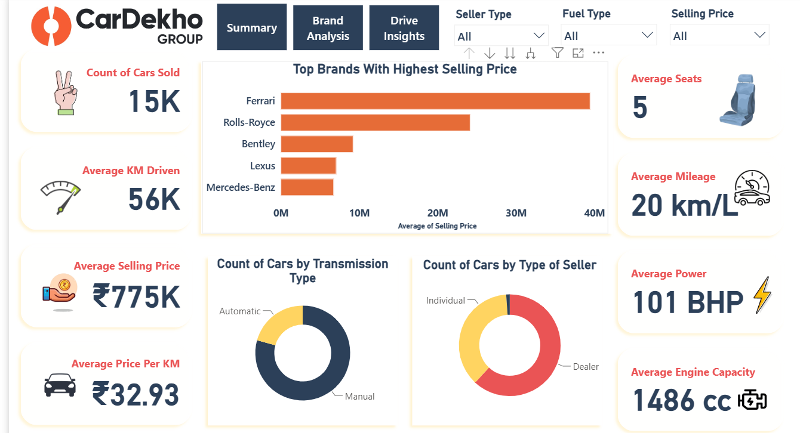
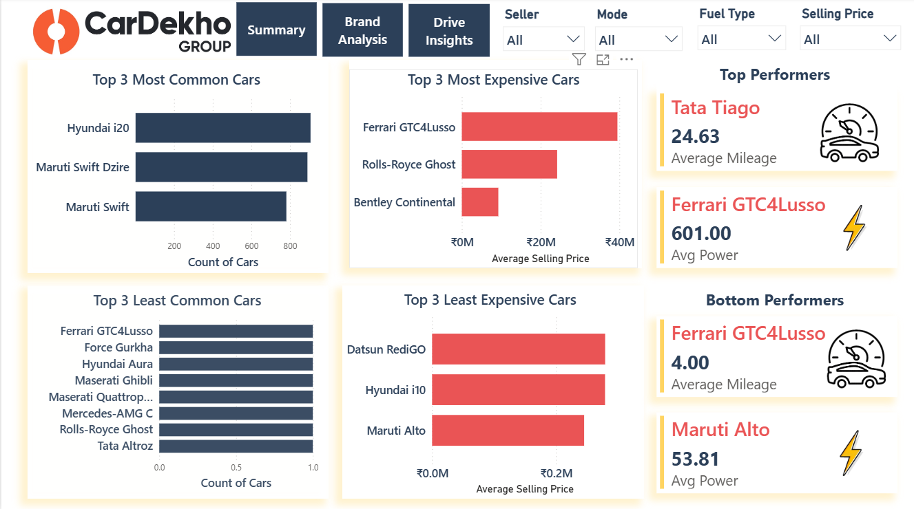
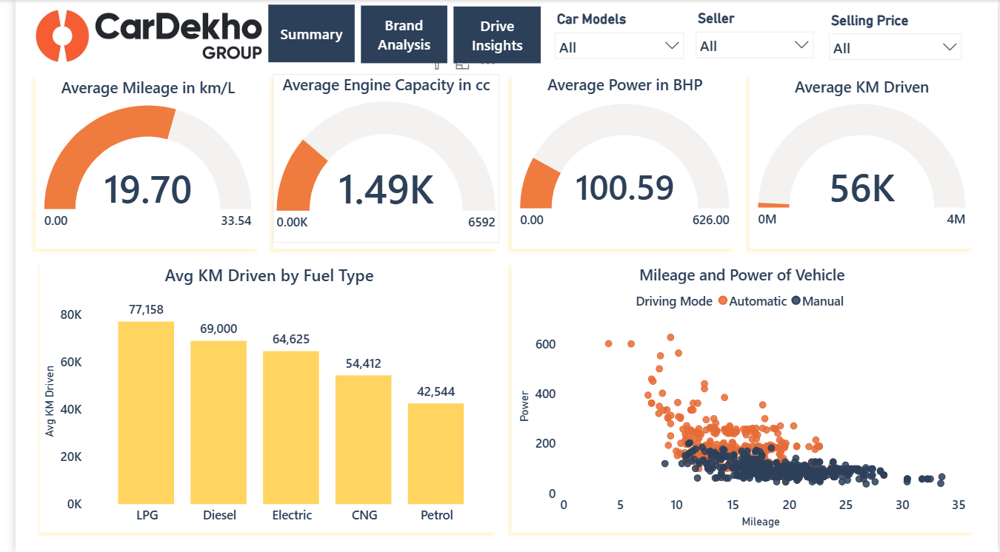

# Used Cars Market Analysis 🚗🏎🚔

This project aims to analyze India's used cars market to identify pricing trends, best and worst car deals, market dynamics, premium brands and customer preferences by using SQL and Power BI. 📊📉📈

## Dataset 📂

Dataset : Taken From Kaggle 

The data is from CarDekho Used Car Dataset available on Kaggle, containing 15411 vehicle listings. 
The columns are :
1. car_name - text 
2. brand - text 
3. model - text 
4. vehicle_age - int 
5. km_driven - int 
6. seller_type - text 
7. fuel_type - text 
8. transmission_type - text 
9. mileage - double 
10. eng - int 
11. max_power - double 
12. seats - int 
13. selling_price - int

## Skills 🔨

1. MySQL
2. Power BI
3. Data Analysis
4. Statistical Insights
5. Comparitive Analysis
6. Data Cleaning
7. Dashboard Design
   
## Analysis 📊💡🔎

1. Ferrari brand has the highest avg selling price of 3,95,00,000 INR while Datsun brand has the lowest average selling price of 320518 INR for pre-owned cars. 🚘💵

2. The most sold brand of cars belongs to Maruti brand. 🚙

3. The average age of vehicles sold is 6 years, maximum age recorded is 29 years and minimum age recorded is 0 years. 🗓📅

4. Hyundai i20 emerges as the dominating car in the used cars market. 🎖

5. Ferrari GTC4Lusso emerges as the car with highest selling price on an average. On the flip side, Maruti Alto emerges as the car with lowest selling price on an average. 💲💹

6. Dealers constitute a  significant chunk of seller in the used cars market and average selling price of cars is 8,72,506 INR. 🤝

7. Automatic cars have higher sellling prices on an average as well as maximum power. 💰

8. Petrol cars constitute bulk of the market . The highest selling price is of Electric cars . 

9. Mini Brand is the most overpriced brand in used cars, followed by Mercedes-Benz. 💲💲

10. Maruti brand emerges as the best deal of used cars after price comparison, followed by Hyundai and Ford. ✔ ✔

11. 5 seater cars are predominant in the market and have high mileage on average. ⬆⬆

12. The highest selling price on average is of 7 seater cars of 11,64,031 INR . 🚙💹

13. Maruti Brand cars have highest mileage folllowed by Renault. 🔼🔼

14. Ferrari brand cars have the least mileage . 🔽🔽
    
15. Manual cars constitute 79.33% of the used car markets.

16. Ferrari GTC4Lusso emerges as the car model with lowest mileage of 4.00 km/L while Tata Tiago emerges as the car model with highest mileage of 24.63 km/L.

17. Ferrari GTC4Lusso is the car model with highest power on an average equal to 601.00 BHP and Maruti Alto with lowest power on an average equal to 53.81 BHP.

18. LPG cars have the most km dirven and CNG cars have highest mileage on an average.  ⛽

## Contributions to the  Pre-owned car market 🏆🏅

This project utilizes SQL queries and Power BI Dashboards to uncover vital market insights and aid customers and sellers in better descision making in the following manner:

1. Helps customers analyze the best and worst pre-owned car deals, hence avoiding overpayment and scams. 📊

2. Helps customers identify high mileage brands for fuel efficiency. 🔼⬆

3. Helps customers to negotiate effectively. 🤝

4. Helps sellers to price the cars competitively by uncovering trends. 💲

5. Helps sellers to identify the brands and models in demand and stock up the inventory accordingly. 🏎🚗

## Dashboards

### Executive Summary Dashboard 

In the Executive Summary Dashboard, the following elements were used:

1. KPI's for count of cars sold and average KM drive, average selling price, average price per KM, average KM driven, average seats, average mileage, average power, avrage engine capacity by utilizing measures

2. Bar Chart for Top Brands with Highest Selling Prices with a drill down feature for various car models within the brand

3. Donut charts for Count of Cars by Transmission Type(Driving Mode) and Count of Cars by Type of Seller

4. Page Navigation Buttons

5. Filters for selling type, fuel type and selling price

### Brand Analysis Dashboard

In the Brand Analysis Dashboard, the following elements were used:

1.  Bar Charts for Top 3 Expensive Cars and Top 3 Least Expensive Cars based on TOP N/BOTTOM N filters

2.  Bar Charts for Top 3 Most Common Cars and Top 3 Least Common Cars based on TOP N/BOTTOM N filters

3.  KPI's for top performing and bottom performing car models based on average mileage and average power using custom measures

4.  Page Navigation Buttons

5. Filters for selling type, fuel type, transmission type(driving mode) and selling price

### Drive Insights Dashboard

In the Drive Insights Dashboard, the following elements were used :

1. Guage charts for average mileage, average power, average engine capacity and average km driven using custom measures.

2. Clustered column chart based on fuel type and average km driven

3. Scatter plot for maximum power and mileage, accompanied by transmission type

4.  Page Navigation Buttons

5. Filters for car models, seller type and selling price
